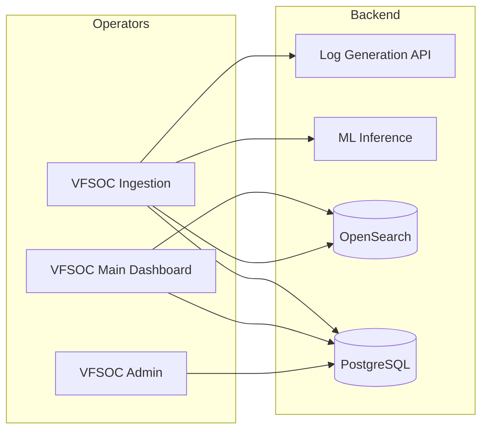

# VFSOC — Vehicle Fleet Security Operations Center

VFSOC is a connected-mobility cybersecurity platform. It ingests data from
connectors that watch your fleet (cars, buses, trucks, drones, AAM,
aviation, rail, transit, marine, EV chargers, sensors, depots and more),
runs rule-based and AI-based detection, and surfaces alerts and indicators
of compromise (IoCs) on a security dashboard.

`VFSOC_Extras` is the **orchestrator repo**. The five application repos
(`VFSOC-Ingestion`, `VFSOC-SIEM`, `VFSOC_Admin`, `VFSOC-log_generation`,
`VFSOC-ML-Models`) live as **siblings** to this folder:

```
<parent>/
├── VFSOC_Extras/        <- this repo (scripts, config, schema, docs)
├── VFSOC-Ingestion/     Ingestion WPF client
├── VFSOC-SIEM/          Main dashboard (Next.js)
├── VFSOC_Admin/         Admin dashboard (Next.js)
├── VFSOC-log_generation/ Mock connector data API (FastAPI)
└── VFSOC-ML-Models/     ML inference service (Flask)
```

| Folder | Role | Stack |
|--------|------|-------|
| `VFSOC-Ingestion`       | **Ingestion dashboard** – manage connectors and data flow | WPF (.NET 8) |
| `VFSOC-SIEM`            | **Main dashboard** – alerts, fleet view, investigations | Next.js 14 |
| `VFSOC_Admin`           | **Admin dashboard** – users, mobility assets, asset–connector links | Next.js 14 |
| `VFSOC-log_generation`  | Mock connector data API | Python / FastAPI |
| `VFSOC-ML-Models`       | ML inference service | Python / Flask |
| `VFSOC_Extras/scripts/` | Orchestrator (setup, start, stop, shortcuts) | PowerShell |

The default `projects_root` in `vfsoc.config.json` is `..` (the parent of
`VFSOC_Extras`). Override it there if your layout differs.

See **[`docs/GUIDE.md`](docs/GUIDE.md)** for the complete operator guide.
A short version follows.

---

## Quick start (Windows)

> Prerequisites: Docker Desktop, Node.js 18+, Python 3.11+, .NET 8 SDK.

```powershell
# 1. One-time setup (installs deps, builds, initialises the database)
.\setup.cmd

# 2. Install the three desktop shortcuts
.\install-shortcuts.cmd

# 3. Start everything (Docker infra + log gen + ML + SIEM + Admin + Ingestion)
.\start.cmd
```

Three icons appear on the Desktop and the two browser dashboards open
automatically:

| Shortcut | Opens |
|----------|-------|
| **VFSOC Ingestion** | The Ingestion WPF client |
| **VFSOC Main Dashboard** | <http://localhost:3000> |
| **VFSOC Admin** | <http://localhost:3001> |

To stop everything: `.\stop.cmd`.

---

## Sign-in roles

Sign-in is shared across all apps via the unified `users` table. The
Admin Dashboard lets administrators create, edit, and disable users
without touching SQL.

| Role | Where they can sign in |
|------|------------------------|
| `admin` | All apps (full power) |
| `operator` | Admin (read+write assets/connectors) |
| `viewer` | Admin (read-only) |
| `analyst` | Main Dashboard (SIEM) |

Initial credentials are provisioned by `setup.cmd` via
`scripts/lib/db-schema.sql`. **Change them immediately** in any deployment
outside a local lab. Credentials are intentionally not displayed in the
sign-in UIs.

---

## What's where

```
<parent>/
├── VFSOC_Extras/                  <- THIS repo (orchestrator)
│   ├── vfsoc.config.json          <- unified config (ports, creds, paths)
│   ├── setup.cmd / start.cmd / stop.cmd / install-shortcuts.cmd
│   ├── admin_hld.md
│   ├── docs/
│   │   └── GUIDE.md               <- full operator manual
│   └── scripts/
│       ├── setup-vfsoc.ps1
│       ├── start-vfsoc.ps1
│       ├── stop-vfsoc.ps1
│       ├── apply-schema.ps1
│       ├── Install-Shortcuts.ps1
│       ├── launchers/             <- helper batch files used by the shortcuts
│       └── lib/
│           ├── Common.ps1
│           ├── db-schema.sql      <- canonical unified schema
│           └── docker-compose.infra.yml
├── VFSOC_Admin/                   <- Next.js admin dashboard
├── VFSOC-SIEM/                    <- main security dashboard
├── VFSOC-Ingestion/               <- WPF ingestion client
├── VFSOC-log_generation/          <- mock connector data
└── VFSOC-ML-Models/               <- ML inference service
```

---

## Ports

| Port | Service |
|------|---------|
| 3000 | VFSOC Main Dashboard (SIEM) |
| 3001 | VFSOC Admin Dashboard |
| 5000 | ML Inference (Flask) |
| 5432 | PostgreSQL (unified DB `vfsoc`) |
| 5601 | OpenSearch Dashboards |
| 8001 | Log Generation API |
| 8088 | Ingestion (optional management API) |
| 9200 | OpenSearch |

All ports are defined in `vfsoc.config.json`. Edit there to change them.

---

## Architecture



---

## Further reading

- [`docs/GUIDE.md`](docs/GUIDE.md) — complete setup + run + troubleshooting guide
- [`admin_hld.md`](admin_hld.md) — admin module high-level design
- `../VFSOC_Admin/README.md` — admin app developer notes
- `../VFSOC-SIEM/README.md` — main dashboard developer notes
- `../VFSOC-Ingestion/README.md` — ingestion client developer notes
