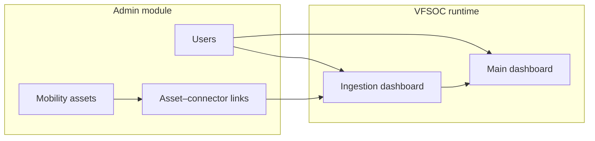
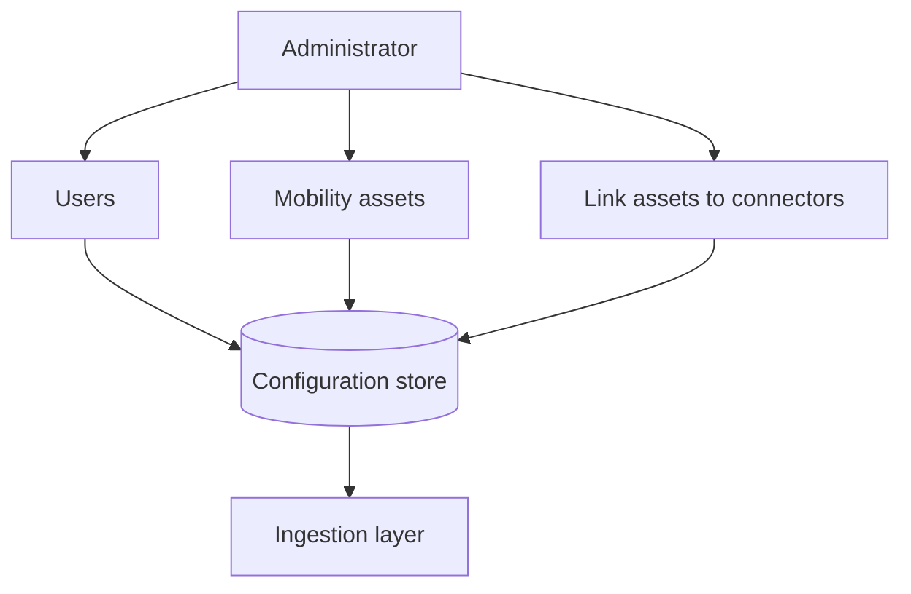
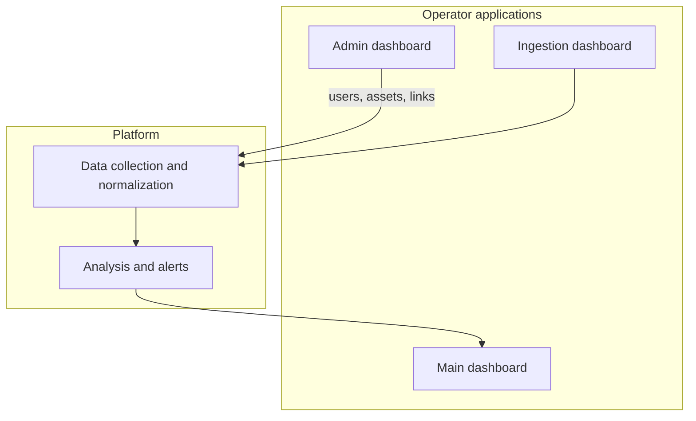
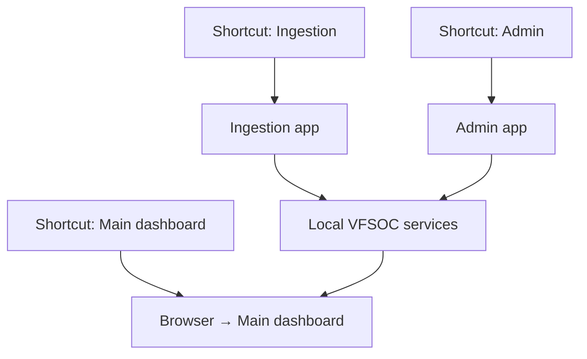
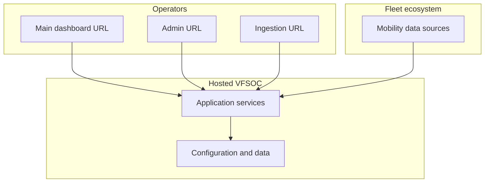

# VFSOC Admin and Deployment

**Document:** High-Level Design (HLD)  
**Version:** 1.0  
**Topic:** VFSOC Admin Module and Deployment  

---

## Contents

1. [Introduction](#1-introduction)
2. [General Description](#2-general-description)
3. [Design and Architecture Details](#3-design-and-architecture-details)
4. [Local and Cloud Deployment](#4-local-and-cloud-deployment)

---

## 1. Introduction

### 1.1 Purpose

This document describes the **VFSOC Admin** module and how VFSOC is deployed locally or in the cloud. It is for system administrators, fleet operators, and security teams who set up the platform, manage users, register mobility assets, and link assets to connectors.

The admin module controls who can log in, which assets belong to the fleet, and which connector supplies data for each asset. Deployment sections explain how to start the ingestion dashboard, the main security dashboard (web), and the admin dashboard.

### 1.2 Scope

This document covers:

- Admin module: user management, mobility asset registration, and linking assets to connectors.
- Local deployment: three desktop shortcuts and what each opens.
- Cloud deployment: the same three application roles in a hosted environment.

Detailed connector rules, machine learning, and ingestion pipeline design are covered in the main VFSOC HLD.

### 1.3 Definitions and Acronyms

| Term | Definition |
|------|------------|
| **VFSOC** | Vehicle Fleet Security Operations Center — fleet cybersecurity monitoring platform. |
| **Mobility asset** | Any monitored item: vehicles, charging stations, drones, sensors, gateways, depots, and similar equipment. |
| **Connector** | A data source type that supplies events for linked assets (e.g., fleet management, EV charging, telematics). |
| **Ingestion dashboard** | Application to manage connectors and ingestion. |
| **Main dashboard** | Web view for alerts, fleet overview, and investigations. |
| **Admin dashboard** | Application for users, assets, and asset–connector links. |

### 1.4 Overview

VFSOC protects a **connected mobility fleet** — not only road vehicles. The admin module defines who uses the system, which assets are in the fleet, and how each asset is tied to a connector. After setup, ingestion pulls data using those links and the main dashboard shows security posture for the fleet.

---

## 2. General Description

### 2.1 Product Focus

The admin module supports the **Connected Mobility Fleet Ecosystem**. VFSOC monitors **mobility assets** across many modes of transport and operations, not only road vehicles. Asset types include:

- **Cars** — Passenger and light-duty connected vehicles that send telematics, location, and diagnostic data for fleet and security monitoring.
- **Buses** — Public and private buses, including electric buses, used for scheduled routes, passenger service, and fleet-wide tracking.
- **Trucks** — Commercial and heavy-duty vehicles used for freight and logistics, often monitored through telematics, cargo systems, and fleet management tools.
- **Drones** — Unmanned aerial vehicles used for delivery, inspection, or surveillance, connected for flight control, navigation, and mission status.
- **Advanced Air Mobility (AAM)** — Electric air taxis, cargo drones, and other new air transport modes that operate from vertiports with charging, scheduling, and dispatch support.
- **Aviation** — Crewed aircraft and related airport or operator assets where connected systems support flight operations, maintenance, and fleet security.
- **Rail** — Trains and rail networks that rely on connected signalling, control, and operations data for safe and on-time service.
- **Transit** — Urban and regional transit operations such as metros, trams, and agency-run bus services with connected vehicles, stops, and passenger systems.
- **Marine** — Ships, ferries, and other vessels, plus port-linked operations, monitored for navigation, cargo, and fleet activity.
- **And more** — Other mobility-related assets such as EV charging stations, depots, vertiports, roadside sensors, gates, and onboard devices that support the fleet.

Each item is registered as a **mobility asset** with a type, identifier, and fleet grouping so the main dashboard matches how the business operates.

### 2.2 Role of the Admin Module

Administrators use the admin dashboard for three tasks:

1. **User management** — Add and edit users and assign roles (administrator, operator, viewer).
2. **Asset management** — Register mobility assets and assign them to a fleet.
3. **Asset–connector linking** — Link each asset to the connector(s) that supply its data so ingestion can attribute events correctly.

---

## 3. Design and Architecture Details

VFSOC has three operator-facing applications: **admin dashboard** (configuration), **ingestion dashboard** (connectors and data flow), and **main dashboard** (web, alerts and fleet view). Admin data is used at sign-in, during ingestion, and on the main dashboard for fleet and alert context.

After configuration, data moves from external sources through connectors, is normalized, analyzed, and shown as alerts on the main dashboard. Asset and fleet IDs from admin are used to label events and alerts.

---

## 4. Local and Cloud Deployment

The same three roles exist locally and in the cloud; only how you open them changes.

| Application | Purpose |
|-------------|---------|
| **Ingestion dashboard** | Connectors, credentials, ingestion status, logs |
| **Main dashboard** | Web URL for alerts, fleet view, investigations |
| **Admin dashboard** | Users, mobility assets, asset–connector links |

### 4.1 Local Deployment

Local deployment suits pilots, labs, or small fleets on a Windows PC or on-prem server.

**Install (high level):**

1. Install the VFSOC local package and run initial setup (configuration store and default admin account).
2. Add three shortcuts to the desktop or Start menu.
3. Open **Admin** first: users, assets, links.
4. Open **Ingestion**: connector credentials and confirm data flow.
5. Open **Main dashboard** in the browser and verify fleet and alerts.

**Three shortcuts:**

| Shortcut | Opens |
|----------|--------|
| **VFSOC Ingestion** | Ingestion dashboard |
| **VFSOC Main Dashboard** | Browser to main dashboard URL |
| **VFSOC Admin** | Admin dashboard |

### 4.2 Cloud Deployment

Cloud deployment hosts the same three roles on managed infrastructure. Operators use HTTPS URLs instead of desktop shortcuts.

**Setup (high level):**

1. Provision a VFSOC tenant with network access to fleet data sources.
2. Receive admin credentials and sign in.
3. Configure users, mobility assets, and asset–connector links (same as local).
4. Configure ingestion and verify data flow.
5. Share main dashboard, admin, and ingestion URLs with the team.

| | Local | Cloud |
|---|--------|--------|
| **Entry** | Three desktop shortcuts | Three URLs |
| **Hosting** | Customer machine | Provider environment |
| **Admin work** | Users, assets, links | Same |

---

*High-level design. See the main VFSOC HLD for full platform architecture.*
