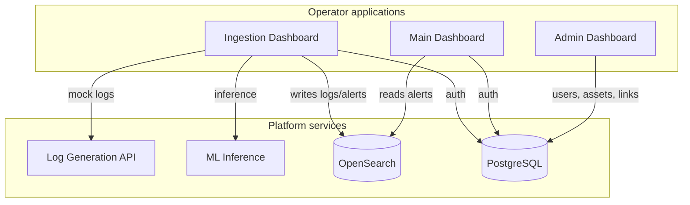

# VFSOC Operator Guide

This is the complete, end-to-end guide for installing, running, using, and
troubleshooting VFSOC on a Windows workstation. It covers the three
operator-facing applications (Ingestion, Main Dashboard, Admin), the
supporting backend services, and the three desktop shortcuts described in
the High-Level Design.

> **Document audience:** system administrators and fleet operators
> deploying VFSOC locally. For cloud deployment notes, see
> [`../admin_hld.md`](../admin_hld.md) section 4.2.

---

## 1. What VFSOC includes

| Component | Folder | Role |
|-----------|--------|------|
| Main Dashboard (SIEM) | `VFSOC-SIEM` | Alerts, IoCs, fleet view, investigations |
| Admin Dashboard | `VFSOC-Admin` | Users, mobility assets, asset–connector links |
| Ingestion Client | `VFSOC-Ingestion` | Connector configuration and data flow |
| Log Generation API | `VFSOC-log_generation` | Mock connector data over HTTP |
| ML Inference Service | `VFSOC-ML-Models` | Anomaly detection models |
| Root Orchestrator | `scripts/` | Setup, start, stop, shortcuts |



---

## 2. Prerequisites

Install the following before running setup. The setup script also checks
for them and reports anything missing.

| Tool | Why | Where |
|------|-----|-------|
| **Windows 10/11** | Host OS (WPF requires Windows) | – |
| **PowerShell 5.1 or 7+** | Runs the orchestrator | Built-in |
| **Docker Desktop** | Runs PostgreSQL and OpenSearch | <https://docs.docker.com/desktop/install/windows-install/> |
| **Node.js 18+** | Runs SIEM and Admin | <https://nodejs.org/> |
| **Python 3.11+** | Runs log generation + ML inference | <https://www.python.org/downloads/windows/> |
| **.NET 8 SDK** | Builds the WPF Ingestion client | <https://dotnet.microsoft.com/download/dotnet/8.0> |

Make sure Docker Desktop is **running** before you run setup or start.

---

## 3. First-time setup

From the repository root (`c:\Users\Hp\Desktop\VFSOC`):

```powershell
.\setup.cmd
```

This single command performs every step you would otherwise have to do
manually:

1. **Verifies tools** — Docker, Node, npm, Python, dotnet.
2. **Writes environment files** — `VFSOC-SIEM\.env.local` and
   `VFSOC-Admin\.env.local` are generated from `vfsoc.config.json`. Both
   apps therefore share the same database, JWT secret, and ports.
3. **Starts Docker infra** — Postgres 16, OpenSearch 2.11, OpenSearch
   Dashboards.
4. **Applies the unified database schema** — creates users, organizations,
   sessions, audit, fleets, mobility_assets, connectors,
   asset_connector_links, and admin_audit. Re-running is safe; everything
   is `IF NOT EXISTS` / `ON CONFLICT`.
5. **Installs Node dependencies** — `npm install` in SIEM and Admin.
6. **Installs Python dependencies** — creates `.venv` and installs
   `requirements.txt` in `VFSOC-log_generation` and `VFSOC-ML-Models`.
7. **Builds the WPF Ingestion client** — `dotnet build` to produce the
   `.exe` used by the desktop shortcut.

Skip any step with the corresponding switch:

```powershell
.\setup.cmd -SkipDocker -SkipPython
```

When it finishes you will see:

```
================================== VFSOC :: Setup complete
```

---

## 4. Install the three desktop shortcuts

These shortcuts match HLD section 4.1 exactly.

```powershell
.\install-shortcuts.cmd
```

This creates three icons on your Desktop:

| Shortcut | Opens | Description |
|----------|-------|-------------|
| **VFSOC Ingestion** | The WPF Ingestion client | Connectors and data flow |
| **VFSOC Main Dashboard** | <http://localhost:3000> (in browser) | Alerts, fleet view, investigations |
| **VFSOC Admin** | <http://localhost:3001> (in browser) | Users, mobility assets, links |

The browser shortcuts are smart: if the Next.js dev server is not running,
they start it first and wait briefly before opening the URL. The Ingestion
shortcut auto-builds the WPF exe the first time if needed.

To remove the shortcuts later: `.\install-shortcuts.cmd -Remove`.
To overwrite existing shortcuts: `.\install-shortcuts.cmd -Force`.

---

## 5. Start everything

```powershell
.\start.cmd
```

This starts the full stack in the right order:

1. Docker infra (Postgres + OpenSearch + Dashboards)
2. Log Generation API on `:8001`
3. ML Inference Service on `:5000`
4. Main Dashboard (SIEM) on `:3000`
5. Admin Dashboard on `:3001`
6. Ingestion WPF client (Windows app)

Each long-running service opens in its own console window so you can watch
logs and stop a single service easily. The launcher waits for both web
dashboards to respond, then opens them in your default browser.

Useful switches:

| Switch | Effect |
|--------|--------|
| `-NoBrowser` | Don't open the browser tabs |
| `-NoIngestion` | Don't launch the WPF client |
| `-NoInfra` | Don't (re)start Docker (assumes it is already up) |

---

## 6. Stop everything

```powershell
.\stop.cmd
```

This:

- Frees ports 3000, 3001, 5000, and 8001 (kills the listening processes).
- Stops the WPF Ingestion client.
- Stops the Docker infra containers.

Use `.\stop.cmd -KeepInfra` if you want to keep Postgres/OpenSearch running
between sessions.

---

## 7. Using the Admin Dashboard

Open **VFSOC Admin** from the Desktop and sign in as `admin / admin@123`.

### 7.1 Overview

The landing page shows counts for users, fleets, assets, connectors, and
active links plus a breakdown of assets by type. Clicking a card jumps to
the matching panel.

### 7.2 Users

- Click **Add user** to create a user with any of four roles:
  - `admin` — full access in all VFSOC apps.
  - `operator` — manage assets, connectors, and links (Admin app).
  - `viewer` — read-only Admin access.
  - `analyst` — SIEM analyst (cannot sign in to Admin).
- Click **edit** to change role, email, password, or active state.
- Click **delete** to remove a user. You cannot delete yourself.

### 7.3 Mobility Assets

- Click **New fleet** to create a logical group (e.g. "EMEA Trucks").
- Click **Register asset** to add a mobility asset.
  - **Asset identifier** — your internal ID (e.g. `EV-CHG-001`,
    `BUS-LON-042`).
  - **Display name** — human-friendly name.
  - **Type** — one of: car, bus, truck, drone, AAM, aviation, rail,
    transit, marine, EV charger, sensor, gateway, depot, vertiport, other.
  - **Fleet** — optional logical grouping.
  - **Status** — active, inactive, maintenance, decommissioned.
- Filter by type or fleet using the search bar above the table.

### 7.4 Connectors

- Seven connector types are seeded automatically (AWS, EV, vehicle
  telematics, roadside sensor, EDR, in-vehicle payment, physical
  security).
- Click **New connector** to add more.
- Use the power button to enable or disable a connector without deleting
  it.

### 7.5 Asset–Connector Links

- Click **Link asset** to associate a mobility asset with a connector.
- Add notes to record context (e.g. "Tesla telematics for VIN 123…").
- Enable/disable links without deleting them.

All admin actions are recorded in the `admin_audit` table for traceability.

---

## 8. Using the Main Dashboard (SIEM)

Open **VFSOC Main Dashboard** and sign in as `analyst / analyst@123`.

The main dashboard remains as before: overview, alerts, IoCs, monitoring,
fleet, assets, resources, and profile sections. With the unified database
you can now also sign in with `admin / admin@123` or any user created from
the Admin app.

---

## 9. Using the Ingestion client

Open **VFSOC Ingestion** to configure connectors and observe ingestion
status. Sign in with the admin credentials above. Connectors will read
data from the Log Generation API (`:8001`) and write enriched logs into
OpenSearch (`:9200`), which the Main Dashboard then visualises.

---

## 10. Configuration reference

`vfsoc.config.json` at the repo root is the single source of truth for
ports, URLs, and default credentials. When you change a value here and
re-run `.\setup.cmd`, the per-project `.env.local` files are regenerated
to match.

```json
{
  "services": {
    "main_dashboard": { "port": 3000 },
    "admin_dashboard": { "port": 3001 },
    "log_generation_api": { "port": 8001 },
    "ml_inference": { "port": 5000 },
    "opensearch": { "port": 9200, "dashboards_port": 5601 },
    "postgres": { "port": 5432, "database": "vfsoc" }
  }
}
```

### Environment variables (auto-generated)

| File | Used by |
|------|---------|
| `VFSOC-SIEM\.env.local` | Main Dashboard |
| `VFSOC-Admin\.env.local` | Admin Dashboard |
| `VFSOC-Ingestion\src\VFSOC.Ingestion.Client\appsettings.json` | Ingestion |

---

## 11. Troubleshooting

### "Docker not available"
Install Docker Desktop and make sure it is running before you re-run
setup or start.

### "port already in use"
Run `.\stop.cmd` to free the dashboard ports, or `.\stop.cmd -KeepInfra`
if you only want to release application ports.

### "could not connect to PostgreSQL"
Re-run `scripts\apply-schema.ps1` once the Postgres container is up
(check with `docker ps`).

### Browser shows "This site can't be reached"
Wait 5–10 seconds — the Next.js dev server takes a moment to bind to
ports 3000 / 3001. The start script will print **VFSOC is running**
when both responded.

### Admin shortcut shows "Account does not have access"
Sign in as `admin`, `operator`, or `viewer`. The `analyst` role can sign
in to the Main Dashboard but not to the Admin Dashboard.

### Default passwords don't work
The schema is seeded only on first run. If you ran an older version,
re-run `scripts\apply-schema.ps1` and try `admin@123` / `analyst@123`.
The hashes for both passwords are baked into the schema.

### WPF client says "appsettings.json not found"
Build it once with `VFSOC-Ingestion\build_and_run.bat` (or run
`scripts\setup-vfsoc.ps1`), then launch with the desktop shortcut.

### ML service fails to start
The ML inference service is **optional**. The WPF client will still
work without it (the rule-based engine continues to function). To skip:
`.\start.cmd` and ignore the ML window error, or remove the
`python -m venv` step.

---

## 12. Cloud deployment (overview)

The same three roles map to managed infrastructure: provision a VFSOC
tenant, sign in with admin credentials, create users / assets / links
in the Admin dashboard, configure ingestion, and share the three URLs
with your team. See `admin_hld.md` section 4.2 for details.

---

## 13. Where to look for what

| If you want to… | Look in |
|-----------------|---------|
| Change ports or credentials | `vfsoc.config.json` |
| Inspect the unified schema | `scripts/lib/db-schema.sql` |
| Add a new admin API | `VFSOC-Admin/src/app/api/...` |
| Add a new SIEM dashboard tab | `VFSOC-SIEM/src/components/dashboard/Dashboard.tsx` |
| Add a new connector | `VFSOC-Ingestion/src/...` (existing patterns) |
| Customise the launcher | `scripts/start-vfsoc.ps1` |
| Customise the shortcuts | `scripts/Install-Shortcuts.ps1` |

---

## 14. Daily workflow cheatsheet

```powershell
.\start.cmd        # in the morning
# ... double-click shortcuts as needed throughout the day ...
.\stop.cmd         # at the end of the day
```

That's it.
